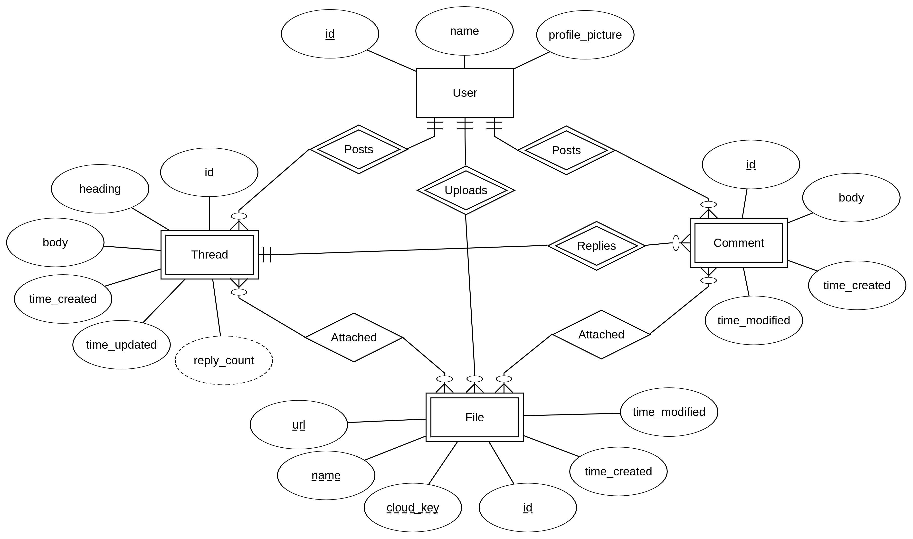

# Condensation Forum

Condensation Forum is a Python 3 web service in EC2 via Elastic Beanstalk.  

## Accessing The Deployed Service

The deployed web service lives at `condensation-forum.us-west-2.elasticbeanstalk.com`.

## Local Instance Prerequisites

 - Install Python 3.6 and PIP 3
 - Install virtual environment support: `pip3 install virtualenv --user`
 - Install GNU Make or manually execute the commands in Makefile when needed

## Deployment Prerequisites

 - Install Local Instance Prerequisites from above
 - Install AWS CLI from AWS wElastic Beanstalkite
 - Use `aws config` to connect to AWS account and region
 - Install Elastic Beanstalk CLI: `pip3 install awsebcli --user`
    - Read here for details: https://docs.aws.amazon.com/elasticbeanstalk/latest/dg/eb-cli3-install.html
 - Nav your shell to the `condensation-forum` folder
 - Have an Elastic Beanstalk instance to deploy to. Ex: `condensation-forum` is our deployed instance
 - Init deployment path: `eb init condensation-forum`
    - Choose region `us-west-2` which is Oregon
	- Do not set up CodeCommit, as we use GitHub and our own deploy script
 - Before deploying, confirm with group members. Run `eb deploy`
 - Quick deployment command `make deploy` is set up already

## Running the local server

 - In the `condensation-forum` folder, create a local config file called `config.local.json`<br/>
```
{
    "accessKey": "AAAABBBBCCCCDDDDEEEE",
    "secretKey": "aaaaaaaabbbbbbbbccccccccddddddddeeeeeeee",
    "region": "us-west-2"
}
```
 - If you have GNU Make, use `make run`
 - If you do not, run `./scripts/run.sh` or `scripts\run.bat`
 - Note: You may need to `chmod u+x run.sh` before you can run in \*nix
 - Note: You should run scripts from the Git root, not from inside the scripts folder
 - Access the site at `http://localhost:5000` or OAuth redirects won't work

# Architecture

## RDS Schema


## File Uploads


## Views and Rendering

Jinja2 and Flask are used to render HTML templates into responses and send them at the appropriate times.

## Deployment

The Python3 application is deployed to EC2 via Elastic Beanstalk. The configuration steps are listed above and are compiled into bash and batch scripts.

# Report Components

## Design Diagrams

### Entity Relationship Diagram



## Scaling

## Monitoring
